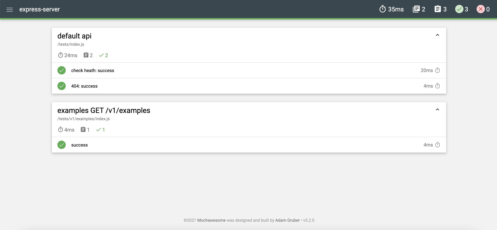
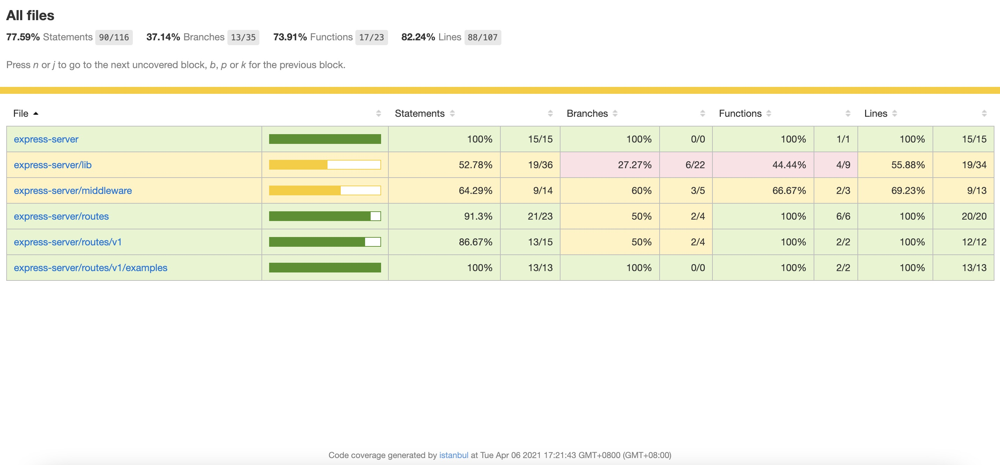

## express 服务端脚手架
## 当前环境
* node: 10.18.0
* npm: 6.13.4

## 目录结构
```js
bin                 // 项目入口
 | www              // 文件启动入口
config              // 配置文件
 |- development     // 开发
 |- test            // 测试
 |- production      // 生产
lib                 // 功能包
 |- api-code        // 识别api的唯一code
 |- enum            // 枚举
 |- logger          // 日志
 |- response-code   // api响应code值
 |- utils           // 工具函数
middleware          // 中间件
 |- cors            // 跨域中间件
routes              // 路由
 |- index.js        // 初始化路径、自动加载所有版本api
 |- v1              // api版本
 |  |- index.js     // 自动加载所有模块api
 |  |- modules      // examples为示例模块
app.js              // loader app
 |
package.json
```

## 新项目启动步骤
```bash
# 拉项目
git clone 该项目 新项目名称

# 初始化
npm run init
# 按照要求输入信息
# 请输入项目名称(express-server):
# 请输入端口号(8080): 
# 是否删除功能示例(/routes/v1/examples/)Y or N?：

# 初始化git
git init
git add .
git commit -m 'Initial commit'
# 设置新项目远程仓库地址
git remote add origin 远程地址
# 设置upstream
git push --set-upstream origin master
# 提交到远程仓库
git push

# 安装依赖
npm install

# 启动服务
npm run server

# health check
curl localhost:你的端口/health # response {"code":0,"msg":"ok","data":null}
```

## docker 镜像构建
```bash
# 需要在项目根目录
docker build -t url:版本号 .
# 查看构建过的镜像
docker images
# 运行构建的镜像
docker run -d -p 访问端口:项目端口 镜像
# curl
curl localhost:你的端口/health # response {"code":0,"msg":"ok","data":null}
```

## 测试报告
```bash
# 生成测试报告
npm run coverage
# 打开测试报告
npm run open-report
```
### 单测

### 代码覆盖率


## 尾言
如果对您有帮助，请给个star。^_^